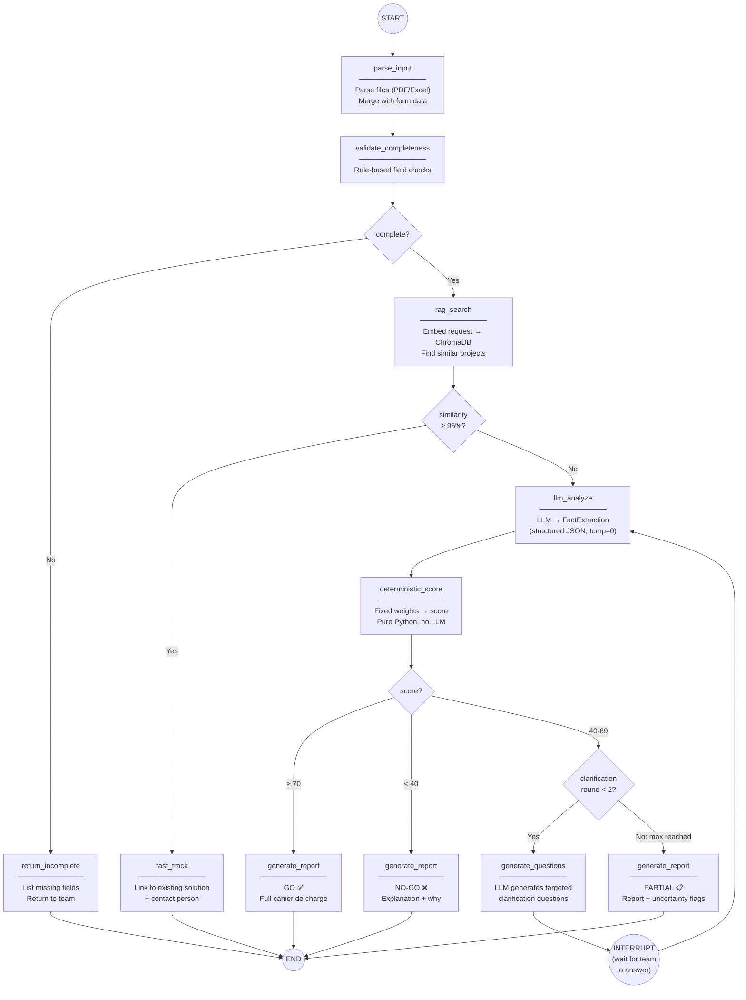

# AI Requirement Hub — MVP Architecture v2 (Final)

> **Stack:** React (Vite) · FastAPI · LangGraph · LiteLLM Router · Pydantic · ChromaDB · SQLite

---

## Tech Stack — Decisions & Rationale

### LLM Orchestration: LangGraph

LangGraph for the LLM pipeline orchestration. Plain async Python for everything else (API, file parsing, DB). This gives you a clean graph you can extend post-MVP without rewriting.

### LLM Provider: LiteLLM Router + `ChatLiteLLMRouter`

Multi-key, multi-provider setup with automatic fallback when a key is exhausted.

```python
from litellm import Router
from langchain_litellm import ChatLiteLLMRouter

model_list = [
    {
        "model_name": "main-model",
        "litellm_params": {
            "model": "gemini/gemini-2.5-flash",
            "api_key": "GEMINI_KEY_1"
        }
    },
    {
        "model_name": "main-model",
        "litellm_params": {
            "model": "gemini/gemini-2.5-flash",
            "api_key": "GEMINI_KEY_2"  # same model, second key
        }
    },
    {
        "model_name": "fallback-model",
        "litellm_params": {
            "model": "openai/gpt-4o",
            "api_key": "OPENAI_KEY"
        }
    },
]

router = Router(
    model_list=model_list,
    fallbacks=[{"main-model": ["fallback-model"]}],
    routing_strategy="simple-shuffle"  # balances across keys
)

llm = ChatLiteLLMRouter(router=router)
```

**Why this works:** LiteLLM handles key rotation and exhaustion automatically. LangChain wraps it as a standard `ChatModel`, so it plugs directly into LangGraph nodes.

### Structured Output: Pydantic + LangChain `.with_structured_output()`

```python
from pydantic import BaseModel, Field

class FactExtraction(BaseModel):
    """Structured facts extracted from the business team's AI project request."""
    has_clear_problem_statement: bool = Field(
        description="Whether the team clearly articulated the problem they want to solve"
    )
    data_availability: Literal["none", "partial", "full"] = Field(
        description="How much relevant data the team currently has access to"
    )
    # ... more fields

structured_llm = llm.with_structured_output(FactExtraction)
# Returns typed Pydantic object, validated automatically
```

**Why Pydantic + LangChain (not raw Pydantic + OpenAI SDK):** Since we're already in the LangChain ecosystem (LangGraph), `.with_structured_output()` works across providers transparently — Gemini, OpenAI, whatever LiteLLM routes to. No provider-specific code.

### Vector DB: ChromaDB (MVP) → Qdrant (Post-MVP)

| Option | Verdict |
|---|---|
| **ChromaDB** ✅ | `pip install chromadb`, runs in-process, zero config. Perfect for MVP. |
| **Qdrant** | Better performance, metadata filtering, Rust-based. Upgrade path for production. |
| **pgvector** | Needs PostgreSQL — we're using SQLite for MVP. Post-MVP option. |

ChromaDB for MVP. If you outgrow it, Qdrant has a local mode (same DX) and scales to production.

### Embeddings: Gemini `text-embedding-004` (MVP) with upgrade path

| Model | Context | Dimensions | Multimodal | Cost |
|---|---|---|---|---|
| **`text-embedding-004`** ✅ | 2,048 tokens | 768 | No | Free tier with Gemini key |
| `gemini-embedding-2` | 8,192 tokens | 3072/1536/768 | Yes | Free tier with Gemini key |
| `BGE-M3` (open-source) | 8,192 tokens | 1024 | No | Free (self-hosted) |

**MVP choice: `text-embedding-004`** — you already have the Gemini API key, it's free, and for project descriptions (short text, ~200-500 words) 2K tokens is plenty.

**Post-MVP upgrade: `gemini-embedding-2`** — when you add PDF/image file embeddings (multimodal), longer documents, or need better accuracy. Note: requires full re-indexing (embeddings are incompatible between versions).

**Alternative to explore post-MVP: `BGE-M3`** — supports hybrid search (dense + sparse), which is excellent for matching technical jargon + semantic meaning simultaneously. Self-hosted = no API cost, full data sovereignty (important for Segula's proprietary project data).

### Database: SQLite (MVP)

Stores: requests, form submissions, scores, reports, user info. Simple, file-based, zero config.

---

## LangGraph Pipeline — The Core

### Graph Definition



### LangGraph Code Structure

```python
from langgraph.graph import StateGraph, END
from langgraph.checkpoint.sqlite import SqliteSaver
from typing import TypedDict, Literal, Annotated
from pydantic import BaseModel

# ── State Definition ──────────────────────────────────
class PipelineState(TypedDict):
    # Input
    form_data: dict
    parsed_files: list[str]
    department: str

    # RAG
    similar_projects: list[dict]
    is_exact_match: bool

    # LLM Analysis
    extracted_facts: dict | None
    clarification_round: int         # 0, 1, or 2
    clarification_questions: list[str]
    clarification_answers: list[str]

    # Scoring
    score: int
    score_breakdown: dict
    decision: str                    # "GO" | "NO_GO" | "NEEDS_CLARIFICATION"

    # Output
    report: str

# ── Node Functions ────────────────────────────────────
def parse_input(state: PipelineState) -> dict:
    """Parse PDF/Excel files, merge with form data."""
    parsed = parse_files(state["form_data"].get("files", []))
    return {"parsed_files": parsed}

def validate_completeness(state: PipelineState) -> dict:
    """Rule-based: check required fields are present."""
    missing = check_required_fields(state["form_data"], state["department"])
    return {"missing_fields": missing}

def rag_search(state: PipelineState) -> dict:
    """Embed request, search ChromaDB for similar historic projects."""
    query = build_rag_query(state["form_data"], state["parsed_files"])
    results = vector_store.similarity_search_with_score(query, k=5)
    exact = any(score >= 0.95 for _, score in results)
    return {"similar_projects": results, "is_exact_match": exact}

def llm_analyze(state: PipelineState) -> dict:
    """LLM extracts structured facts. temp=0, JSON enforced."""
    context = build_analysis_context(state)
    facts = structured_llm.invoke(context)  # Returns FactExtraction
    return {"extracted_facts": facts.model_dump()}

def deterministic_score(state: PipelineState) -> dict:
    """Pure Python scoring — no LLM involved."""
    result = calculate_feasibility_score(
        state["extracted_facts"],
        state["similar_projects"]
    )
    return {
        "score": result["score"],
        "score_breakdown": result["breakdown"],
        "decision": result["decision"]
    }

def generate_questions(state: PipelineState) -> dict:
    """LLM generates targeted clarification questions."""
    questions = clarification_llm.invoke(...)
    return {
        "clarification_questions": questions,
        "clarification_round": state["clarification_round"] + 1
    }

def generate_report(state: PipelineState) -> dict:
    """Generate the final cahier de charge (template + LLM text)."""
    report = build_cahier_de_charge(state)
    return {"report": report}

# ── Routing Functions ─────────────────────────────────
def route_after_validation(state) -> str:
    if state.get("missing_fields"):
        return "return_incomplete"
    return "rag_search"

def route_after_rag(state) -> str:
    if state["is_exact_match"]:
        return "fast_track"
    return "llm_analyze"

def route_after_score(state) -> str:
    if state["decision"] == "GO":
        return "generate_report_go"
    elif state["decision"] == "NO_GO":
        return "generate_report_nogo"
    else:  # NEEDS_CLARIFICATION
        if state["clarification_round"] < 2:
            return "generate_questions"
        return "generate_report_partial"

# ── Build Graph ───────────────────────────────────────
workflow = StateGraph(PipelineState)

workflow.add_node("parse_input", parse_input)
workflow.add_node("validate_completeness", validate_completeness)
workflow.add_node("rag_search", rag_search)
workflow.add_node("fast_track", fast_track)
workflow.add_node("llm_analyze", llm_analyze)
workflow.add_node("deterministic_score", deterministic_score)
workflow.add_node("generate_questions", generate_questions)
workflow.add_node("generate_report_go", generate_report)
workflow.add_node("generate_report_nogo", generate_report)
workflow.add_node("generate_report_partial", generate_report)
workflow.add_node("return_incomplete", return_incomplete)

workflow.set_entry_point("parse_input")
workflow.add_edge("parse_input", "validate_completeness")
workflow.add_conditional_edges("validate_completeness", route_after_validation)
workflow.add_conditional_edges("rag_search", route_after_rag)
workflow.add_edge("llm_analyze", "deterministic_score")
workflow.add_conditional_edges("deterministic_score", route_after_score)
workflow.add_edge("generate_questions", END)  # INTERRUPT: wait for team answer
# When team answers, re-invoke graph from "llm_analyze" with updated state

workflow.add_edge("generate_report_go", END)
workflow.add_edge("generate_report_nogo", END)
workflow.add_edge("generate_report_partial", END)
workflow.add_edge("fast_track", END)
workflow.add_edge("return_incomplete", END)

# Compile with checkpointing (persists state between clarification rounds)
memory = SqliteSaver.from_conn_string("checkpoints.db")
app = workflow.compile(checkpointer=memory)
```

**Key LangGraph benefit here:** `SqliteSaver` checkpointing means the graph state persists between clarification rounds. When the team answers questions (could be hours/days later), you resume from exactly where you left off.

---

## Project Structure (Parallel-Work Friendly)

> One file per node = zero merge conflicts. See `parallel_work_plan.md` for full details.

```
AI_requirement_hub/
├── backend/
│   ├── main.py                          # [TOGETHER]  FastAPI entry point
│   ├── config.py                        # [SHARED]    Settings, keys, thresholds
│   │
│   ├── contracts/                       # [SHARED — BUILD FIRST, DAY 1]
│   │   ├── state.py                     #   PipelineState TypedDict
│   │   └── schemas.py                   #   All Pydantic models
│   │
│   ├── nodes/                           # One file per graph node
│   │   ├── parse_input.py               # [TRACK B]
│   │   ├── validate_completeness.py     # [TRACK B]
│   │   ├── rag_search.py                # [TRACK A]
│   │   ├── fast_track.py                # [TRACK A]
│   │   ├── llm_analyze.py              # [TRACK A]
│   │   ├── deterministic_score.py       # [TRACK B]
│   │   ├── generate_questions.py        # [TRACK A]
│   │   └── generate_report.py           # [TRACK B]
│   │
│   ├── graph/
│   │   ├── builder.py                   # [TOGETHER]  Wire nodes + edges
│   │   └── routing.py                   # [TOGETHER]  Conditional edge functions
│   │
│   ├── services/
│   │   ├── llm.py                       # [TRACK A]   LiteLLM Router setup
│   │   └── vectorstore.py              # [TRACK A]   ChromaDB setup
│   │
│   ├── prompts/
│   │   ├── base.py                      # [TRACK A]   Shared prompt parts
│   │   └── corporate_support.py         # [TRACK A]   MVP department prompt
│   │
│   ├── api/
│   │   ├── routes_submissions.py        # [TOGETHER]
│   │   ├── routes_clarification.py      # [TOGETHER]
│   │   └── routes_dashboard.py          # [TOGETHER]
│   │
│   └── data/
│       ├── historic_projects.json       # [TRACK A]   Seed RAG data
│       └── department_configs.json      # [TRACK B]   Form field configs
│
├── frontend/                            # [PHASE 4 — TOGETHER, after backend works]
│   ├── src/
│   │   ├── pages/
│   │   │   ├── SubmissionForm.jsx
│   │   │   ├── Clarification.jsx
│   │   │   ├── Dashboard.jsx
│   │   │   └── Report.jsx
│   │   ├── components/
│   │   │   ├── FormFields/
│   │   │   ├── ScoreCard.jsx
│   │   │   └── StatusTracker.jsx
│   │   └── App.jsx
│   ├── index.html
│   ├── package.json
│   └── vite.config.js
│
├── tests/
│   ├── test_scoring.py                  # [TRACK B]
│   ├── test_rag.py                      # [TRACK A]
│   ├── test_llm_analyze.py             # [TRACK A]
│   ├── test_validation.py              # [TRACK B]
│   └── test_graph_e2e.py               # [TOGETHER]
│
├── requirements.txt
├── .env.example                         # API key names (committed)
├── .env                                 # API keys (gitignored)
├── docker-compose.yml                   # One command to run everything
├── backend/Dockerfile                   # Python + all deps
├── frontend/Dockerfile                  # Node build + nginx serve
├── .dockerignore
└── README.md
```

---

## API Endpoints (FastAPI)

```python
# ── Submission ────────────────────────────────────────
POST   /api/submissions/             # Submit new request (form + files)
GET    /api/submissions/{id}         # Get submission status & details
GET    /api/submissions/             # List all submissions (filtered by dept/status)

# ── Clarification ────────────────────────────────────
GET    /api/submissions/{id}/clarification  # Get current clarification questions
POST   /api/submissions/{id}/clarification  # Submit answers → re-triggers graph

# ── Reports ──────────────────────────────────────────
GET    /api/submissions/{id}/report  # Get generated cahier de charge
GET    /api/submissions/{id}/score   # Get score breakdown

# ── Dashboard (AI Team) ─────────────────────────────
GET    /api/dashboard/pending        # Requests awaiting review
POST   /api/dashboard/{id}/decision  # AI team final Go/No-Go override

# ── Config ───────────────────────────────────────────
GET    /api/departments/             # List departments + form configs
GET    /api/departments/{id}/fields  # Department-specific form fields
```

---

## Data Flow (End to End)

```
Business Team                     System                              AI Team
     │                               │                                   │
     │─── 1. Select department ─────>│                                   │
     │<── 2. Adaptive form ─────────│                                   │
     │─── 3. Fill form + files ─────>│                                   │
     │                               │── 4. [parse_input]                │
     │                               │── 5. [validate_completeness]      │
     │<── (if incomplete) ──────────│                                   │
     │                               │── 6. [rag_search] ChromaDB       │
     │                               │── 7. Exact match? → fast track    │
     │                               │── 8. [llm_analyze] LangGraph      │
     │                               │      LiteLLM → Gemini/fallback   │
     │                               │      → FactExtraction (Pydantic) │
     │                               │── 9. [deterministic_score]        │
     │                               │      Pure Python weights          │
     │                               │                                   │
     │<── (if 40-69%) questions ────│                                   │
     │─── answers ─────────────────>│                                   │
     │    (max 2 rounds)             │── 10. Resume graph (checkpoint)   │
     │                               │── 11. Re-analyze + re-score       │
     │                               │                                   │
     │                               │── 12. [generate_report]           │
     │                               │──────────────────────────────────>│
     │                               │                    13. Review      │
     │                               │                    14. Final call  │
     │<── 15. Result notification ──│<──────────────────────────────────│
```

---

## Dependencies (`requirements.txt`)

```
# API
fastapi>=0.115.0
uvicorn>=0.30.0
python-multipart>=0.0.9

# LLM Orchestration
langgraph>=0.2.0
langchain-core>=0.3.0
langchain-litellm>=0.2.0
litellm>=1.40.0

# Structured Output
pydantic>=2.7.0

# RAG
chromadb>=0.5.0
google-generativeai>=0.7.0       # For text-embedding-004

# File Parsing
pdfplumber>=0.11.0
pandas>=2.2.0
openpyxl>=3.1.0

# Database
aiosqlite>=0.20.0

# Utils
python-dotenv>=1.0.0
```

---

## Docker Setup (MVP — Fastest Route)

Single container per service. SQLite + ChromaDB are file-based, so they live as volumes — no database container needed.

### `backend/Dockerfile`

```dockerfile
FROM python:3.12-slim

WORKDIR /app

COPY requirements.txt .
RUN pip install --no-cache-dir -r requirements.txt

COPY backend/ ./backend/
COPY tests/ ./tests/

# SQLite + ChromaDB data persisted via volume
VOLUME /app/data

EXPOSE 8000

CMD ["uvicorn", "backend.main:app", "--host", "0.0.0.0", "--port", "8000", "--reload"]
```

### `frontend/Dockerfile`

```dockerfile
# Build stage
FROM node:20-alpine AS build
WORKDIR /app
COPY frontend/package*.json ./
RUN npm ci
COPY frontend/ ./
RUN npm run build

# Serve stage
FROM nginx:alpine
COPY --from=build /app/dist /usr/share/nginx/html
COPY frontend/nginx.conf /etc/nginx/conf.d/default.conf
EXPOSE 80
```

### `docker-compose.yml`

```yaml
services:
  backend:
    build:
      context: .
      dockerfile: backend/Dockerfile
    ports:
      - "8000:8000"
    env_file:
      - .env
    volumes:
      - app-data:/app/data        # SQLite + ChromaDB persist here
      - ./backend:/app/backend    # Hot reload during dev
    restart: unless-stopped

  frontend:
    build:
      context: .
      dockerfile: frontend/Dockerfile
    ports:
      - "3000:80"
    depends_on:
      - backend
    restart: unless-stopped

volumes:
  app-data:
```

### Usage

```bash
# First run
docker compose up --build

# After code changes (backend hot-reloads, frontend needs rebuild)
docker compose up --build frontend

# On a new machine: clone repo, add .env, run
git clone <repo> && cp .env.example .env  # fill keys
docker compose up --build
```

**That's it.** No multi-container DB setup, no orchestration complexity. SQLite and ChromaDB are file-based — one volume handles persistence. When you move to PostgreSQL + Qdrant post-MVP, you add those as services in docker-compose.

---

## Post-MVP Upgrade Path

| Current (MVP) | Upgrade To | When |
|---|---|---|
| ChromaDB | Qdrant (server mode) | When historic projects > 1000 |
| `text-embedding-004` | `gemini-embedding-2` or `BGE-M3` | When adding multimodal files or need hybrid search |
| SQLite | PostgreSQL + pgvector | When multiple users concurrently |
| Simple PDF/Excel parsing | OCR + CAD + image pipeline | When teams need to attach complex files |
| LangGraph (simple graph) | Multi-agent workflows | When adding specialized sub-agents per domain |
| No feedback loop | AI team corrections → fine-tuning | When enough validated data collected |
| Single Docker containers | Separate DB containers (Postgres, Qdrant) | When scaling to production |
